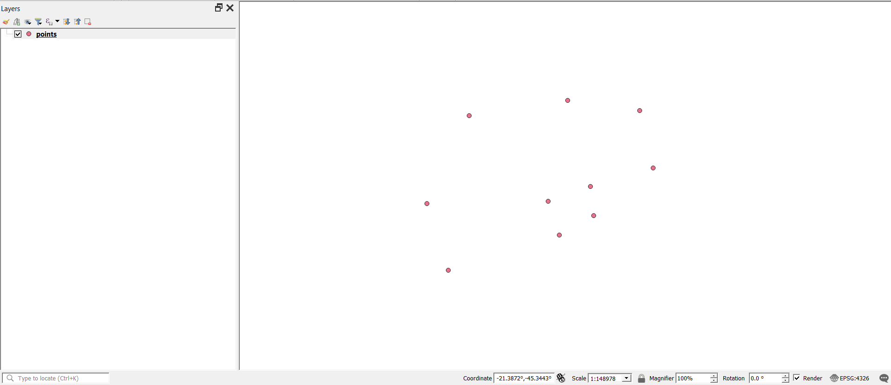

# Temporal Resample
This plugin resamples a vector layer of points based on a mathematical method and a equal time spacing for the features.

Author = João Vitor Pimenta   
Email = jvpjoaopimenta@gmail.com   

## Technologies
The following technologies were used in processing the algorithms of this plugin:  
QGIS  
Pandas

## Installation
With QGIS open, follow these steps: plugins -> manage and install plugins -> install from ZIP
Then select the ZIP containing this plugin -> install plugin    
or place this plugin in the folder corresponding to plugins installed in QGIS,
normally found in the path:   C:\Users\User\AppData\Roaming\QGIS\QGIS3\profiles\default\python\plugins\

# Tools
This plugin only has one tool, which is:

## Temporal Resample
This tool create a vectorized inundation area from a DEM, a area and from a parameter provided by the user, which could be elevation, height, area or volume

**Input Layer:** The layer with each feature representing a point in time.
**Field with datetime:** The field with datetime values.
**Date time format:** The datetime format that the field values ​​are in.
**Delta time:** The new time difference in features after resampling.
**Method:** Mathematical method for interpolating coordinates.
**Order:** If the method is slinear or polynomial, the order of the function.
                       
**Output:**  
**Resampled layer:** The path to the resampled layer.

## Example of use
You have data from points that are variously spaced in time and you want to standardize them to data every 5 minutes, interpolating the data using the spline method with order 3, to have a smoother curve

The sequence of images represents:   
1: Point layer with datetime field
2: Point layer attribute table 
3: Parameters for Temporal Resample processing 
4: Resampled point layer 
5: Resampled point layer attribute table

## Recommendations 
All methods used for interpolation were taken from: https://pandas.pydata.org/docs/reference/api/pandas.DataFrame.interpolate.html It is highly recommended to read how each method works to make the best choice

## Acknowledgment
Special thanks to the authors of all the technologies used in this plugin and who made it possible,
to my parents and friends, to my teachers, and to the giants who, by standing on their shoulders,
allowed me to see further

## Contributing
This software readily accepts modifications and optimizations, as long as they make sense for proper functioning and user comfort

## License
[GNU General Public License, version 3](https://www.gnu.org/licenses/gpl-3.0.html)